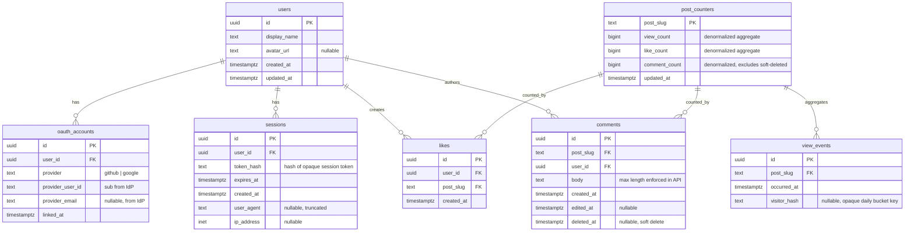

# Post engagement — entity-relationship model

This document describes the **logical** data model for a separate engagement API service. Post bodies live in GitHub MDX (Astro live collection); this database stores **users**, **sessions**, **OAuth links**, **views**, **likes**, and **comments**, keyed by a stable string `post_slug` (for example the MDX filename without `.mdx`).

All timestamps are stored in **UTC** (`timestamptz` in Postgres). API responses use **RFC 3339** ISO-8601 strings.

---

## Mermaid ERD

---

## Table notes

### `users`

- Created on **first successful OAuth login** (or merged if you implement account linking later).
- `display_name` and `avatar_url` may be refreshed from the IdP on each login (implementation choice).

### `oauth_accounts`

- **Unique constraint**: `(provider, provider_user_id)` so the same GitHub or Google account cannot attach to two users.
- `provider` is an enum-like string: `github` | `google`.
- **Optional v2**: allow multiple providers per user; linking flow is out of scope for v1.

### `sessions`

- Store only a **hash** of the session token (never the raw token in the database).
- Delete or expire rows on logout; periodic job can purge `expires_at < now()`.
- `ip_address` / `user_agent` are optional fields for abuse analysis; document retention in your privacy policy.

### `post_counters`

- **One row per** `post_slug` that has ever received engagement (or pre-seeded slugs if you use an allowlist).
- `view_count`, `like_count`, and `comment_count` are **denormalized** for fast reads; update them in the same transaction as the underlying `likes` / `comments` / `view_events` insert (or use triggers in the API’s database).
- There is no FK from `post_counters` to GitHub: **`post_slug` is an application-level contract** with the static site.

### `likes`

- **Unique constraint**: `(user_id, post_slug)` — at most one like per user per post.
- **Foreign key**: `post_slug` references `post_counters(post_slug)` OR use a deferred pattern: insert `post_counters` on first touch. The ERD shows logical association with counters for clarity.

### `comments`

- **Soft delete**: set `deleted_at` instead of hard delete; exclude from public lists and from `comment_count`.
- **Authorization**: only the row’s `user_id` may update body or set `deleted_at` (enforced in the API).

### `view_events` (optional but recommended)

- Append-only (or batched) rows for **rate limiting and deduplication** research; aggregate into `post_counters.view_count`.
- `visitor_hash`: opaque HMAC or hash of `(post_slug, ip, user_agent, UTC date)` — **do not** store raw IP in this table if you want minimization; hashing with a server secret is enough to dedupe daily views per visitor bucket.

---

## Indexes (suggested)

| Table            | Index                                                     | Purpose                          |
| ---------------- | --------------------------------------------------------- | -------------------------------- |
| `likes`          | `UNIQUE (user_id, post_slug)`                             | Enforce one like per user/post   |
| `likes`          | `(post_slug)`                                             | Reconcile counts if needed       |
| `comments`       | `(post_slug, created_at DESC)` WHERE `deleted_at IS NULL` | Paginated lists                  |
| `sessions`       | `(token_hash)`                                            | Lookup on each authenticated req |
| `oauth_accounts` | `UNIQUE (provider, provider_user_id)`                     | Login lookup                     |
| `view_events`    | `(post_slug, occurred_at)`                                | Analytics / cleanup              |

---

## Out of scope for v1 (ERD extensions later)

- Nested comments (`parent_comment_id`).
- Moderation roles, reports, bans.
- Rich text / markdown storage for comment bodies (v1 is plain text with length cap).
